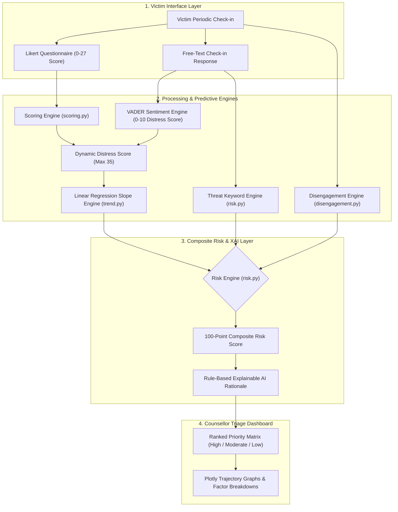

# AI-Powered Dynamic Mental Health Monitoring and Distress Prediction System for Victims of Atrocities

[](https://www.python.org/)
[](https://streamlit.io/)
[](https://www.sih.gov.in/)
[](https://socialjustice.gov.in/)
[](LICENSE)

An AI-powered, privacy-focused, 100% local prototype built for Smart India Hackathon problem statement **SIH26094** issued by India's **Ministry of Social Justice and Empowerment**.

This system continuously monitors the psychological well-being of victims of heinous crimes (sexual assault, caste-based violence, murder of breadwinners, arson, and threatened witnesses) throughout their investigation, trial, rehabilitation, and compensation stages, predicting escalating distress **before** it becomes a crisis.

---

## 📐 System Architecture & Data Workflow



---

## ✨ Key Technical Innovations

1. **Multi-Modal Dynamic Distress Scoring (0–35)**:
   - **Structured Ratings (0–27)**: Based on clinical PHQ-9 and GAD-7 standards.
   - **VADER Sentiment Analysis (0–10)**: Local rule-based sentiment processing on free-text updates.
2. **Predictive Trajectory Engine (Linear Regression Slope)**:
   - Fits degree-1 linear regression (`numpy.polyfit`) across 4–6 weeks of check-ins to detect **worsening** trends (+ slope) early.
3. **Disengagement & Threat Safeguards**:
   - **Disengagement Flag**: Automatically flags victims who miss 2 consecutive expected check-ins (detecting forced silence or intimidation).
   - **Threat Keywords**: Scans text for intimidation phrases (*"followed"*, *"warned"*, *"scared"*, *"withdraw the case"*).
4. **100-Point Composite Risk Score**:
   - Deterministic risk weighting combining Trend (40 pts), Category Severity (25 pts), Threat Keywords (20 pts), and Disengagement (15 pts).
5. **Traceable Explainable AI (XAI)**:
   - Zero black-box LLMs or third-party cloud APIs. Every risk score produces a plain-text rationale auditable for judicial and administrative accountability.

---

## 📊 Composite Risk Scoring Model

| Risk Factor | Scoring Rationale | Max Weight |
| :--- | :--- | :--- |
| **Distress Trend Slope** | Worsening = 40 pts, Stable = 15 pts, Improving = 0 pts | **40 Points** |
| **Crime Category Severity** | Category Severity Weight (1 to 5) $\times$ 5 | **25 Points** |
| **Threat Keyword Flag** | Detection of intimidation/threat language in text | **20 Points** |
| **Disengagement Status** | 2 consecutive missed expected check-ins | **15 Points** |
| **Total Composite Score** | Capped at Maximum of 100 points | **100 Points** |

- **🔴 High Risk**: Composite Score $\ge 60$
- **🟡 Moderate Risk**: Composite Score $35 - 59$
- **🟢 Low Risk**: Composite Score $< 35$

---

## ⚡ Quick Setup & Running Locally

### 1. Clone the Repository
```bash
git clone https://github.com/vickysingh-rajpoot/AI-Powered-Dynamic-Mental-Health-Monitoring-and-Distress-Prediction-System-for-Victims-of-Atrocities.git
cd AI-Powered-Dynamic-Mental-Health-Monitoring-and-Distress-Prediction-System-for-Victims-of-Atrocities
```

### 2. Create and Activate Virtual Environment
- **Windows**:
  ```cmd
  python -m venv venv
  venv\Scripts\activate
  ```
- **macOS / Linux**:
  ```bash
  python3 -m venv venv
  source venv/bin/activate
  ```

### 3. Install Dependencies
```bash
pip install -r requirements.txt
```

### 4. Seed Database with Synthetic Victim Profiles
```bash
python data/generate_synthetic_data.py
```

### 5. Launch the Streamlit Application
```bash
streamlit run app.py
```
Open **`http://localhost:8501`** in your browser.

---

## 📁 Repository Structure

```text
├── app.py                         # Streamlit landing page & entry point
├── pages/
│   ├── 1_Victim_Checkin.py       # Victim-facing check-in form portal
│   └── 2_Counsellor_Dashboard.py  # Prioritized counsellor triage dashboard & Plotly charts
├── data/
│   ├── generate_synthetic_data.py # Data generator seeding 10 synthetic victim profiles
│   └── synthetic_checkins.csv     # Exported CSV dataset
├── engine/
│   ├── scoring.py                 # Multi-modal scoring (PHQ-9/GAD-7 + VADER sentiment)
│   ├── trend.py                   # Linear regression slope fitting for trajectory classification
│   ├── disengagement.py           # Consecutively missed check-in & threat keyword detection
│   └── risk.py                    # 0-100 composite risk scoring & transparent XAI engine
├── db/
│   └── victims.db                 # Built-in SQLite database
├── .streamlit/
│   └── config.toml                # Custom Streamlit theme configuration
├── .gitignore                     # Git ignore rules
├── requirements.txt               # Dependencies list
└── README.md                      # Project documentation
```

---

## 📄 License
This project is licensed under the MIT License - see the [LICENSE](LICENSE) file for details.
