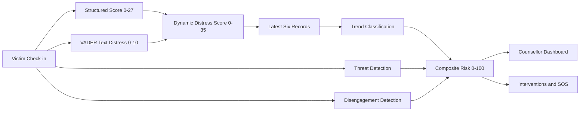

# AI-Powered Dynamic Mental Health Monitoring System

A local, explainable Streamlit prototype for monitoring distress trends among victims of atrocities and helping counsellors prioritize support.

> **Prototype scope:** This project uses synthetic/demo data and rule-based local processing. It is not a clinical diagnostic system. SOS generates a notice for review; it does not contact emergency services or government authorities.

## Overview

Victims complete periodic check-ins containing structured well-being ratings and an optional free-text update. The system combines these inputs with recent distress history, case severity, threat-language detection, and missed check-ins to produce a transparent risk classification.

The counsellor dashboard provides:

- Ranked High, Moderate, and Low Risk cases
- Dynamic distress trajectory charts
- Explainable risk-factor breakdowns
- National, State, and District filtering
- Rule-based intervention recommendations
- A downloadable Emergency SOS notice for High Risk cases

## Architecture



## Core Risk Model

### Structured questionnaire

Four sliders accept values from 1 to 5:

| Measure | Distress mapping | Maximum points |
|---|---|---:|
| Anxiety | `(anxiety - 1) / 4 * 7` | 7 |
| Sleep | `(5 - sleep) / 4 * 6.5` | 6.5 |
| Hopefulness | `(hope - 1) / 4 * 6.5` | 6.5 |
| Mood | `(5 - mood) / 4 * 7` | 7 |

The values are added and rounded to produce a structured score from 0 to 27.

### Dynamic distress

VADER converts free text into a distress value from 0 to 10:

```text
sentiment_distress = ((1 - compound_sentiment) / 2) * 10
dynamic_distress = min(35, structured_score + sentiment_distress)
```

Blank text produces a sentiment distress value of 0.

### Trend

The system fits a linear trend to the latest six check-in scores:

```text
slope >  0.8  -> Worsening
slope < -0.8  -> Improving
otherwise     -> Stable
```

A single new check-in does not automatically change a case ranking. The ranking uses recent history and multiple risk factors. Consistent recent check-ins make trend changes more visible.

### Composite score

| Factor | Points |
|---|---:|
| Worsening trend | 40 |
| Stable trend | 15 |
| Improving trend | 0 |
| Category severity | `category_weight * 5` |
| Threat keyword detected in either latest two texts | 20 |
| Two latest check-ins missed | 15 |

Classification thresholds:

```text
60 or above -> High Risk
35 to 59    -> Moderate Risk
Below 35    -> Low Risk
```

## Application Workflow

1. Select a case on the Victim Check-in page.
2. Enter the four well-being ratings and optional free text.
3. Submit the check-in.
4. The record is stored in the local SQLite database.
5. The scoring engine calculates structured, sentiment, and dynamic distress values.
6. The trend engine evaluates recent history.
7. The risk engine combines trend, severity, threat, and disengagement factors.
8. The dashboard ranks and filters cases.
9. The intervention engine recommends actions.
10. High Risk cases can generate a local SOS notice.

## Geographic Monitoring

The dashboard supports three administrative levels:

- **National Overview:** all tracked cases
- **State Level:** cases in the selected state
- **District Level:** cases in the selected district within the selected state

Case metadata includes state, district, category, channel, and preferred language.

## Intervention Rules

Recommendations are generated from risk factors:

- Threat detected: Witness Protection and Relocation
- Two consecutive missed check-ins: Field Welfare Officer Home Visit
- Worsening trend: Urgent Psychiatric Trauma Care
- Category weight of 4 or 5: Legal Aid and Financial Compensation
- Low risk: Continue Monitoring

Recommendations are explainable and displayed with an urgency level and responsible authority. These are prototype recommendations for demonstration, not automatically executed government actions.

## SOS Notice

The SOS control is available in the dashboard only for cases classified as High Risk. It generates a formatted, downloadable text notice containing the case details, location, risk score, trend, threat flag, disengagement flag, and suggested authority actions.

No external emergency, police, hospital, helpline, or government API is connected.

## Running Locally

### Windows

```cmd
python -m venv venv
venv\Scripts\activate
pip install -r requirements.txt
python data\generate_synthetic_data.py
streamlit run app.py
```

Open `http://localhost:8501` in a browser.

The database is initialized automatically when missing. Running the generator again recreates the demo SQLite database and CSV data.

## Project Structure

```text
app.py                           Streamlit landing page and database status
pages/1_Victim_Checkin.py       Victim check-in form and database insert
pages/2_Counsellor_Dashboard.py Dashboard, charts, filters, interventions, SOS
engine/scoring.py                Structured, sentiment, and dynamic scoring
engine/trend.py                  Recent-history trend calculation
engine/disengagement.py          Missed check-in detection
engine/risk.py                   Threat detection and composite risk
engine/interventions.py          Intervention and SOS notice generation
data/generate_synthetic_data.py Synthetic SQLite and CSV data generator
data/synthetic_checkins.csv     Demo check-in records
db/victims.db                    Local SQLite database generated at runtime
requirements.txt                 Python dependencies
```

## Technology

- Python 3.10+
- Streamlit
- SQLite
- pandas
- NumPy
- Plotly
- VADER Sentiment

No cloud AI model or third-party API is required for the prototype.

## Limitations and Future Work

This prototype does not provide authentication, role-based access, clinical diagnosis, encryption, real emergency dispatch, or production-grade privacy controls. Threat analysis currently considers only the latest two text records. Production work would require clinical validation, security review, consent management, secure deployment, audited workflows, and verified integrations with authorized support services.
